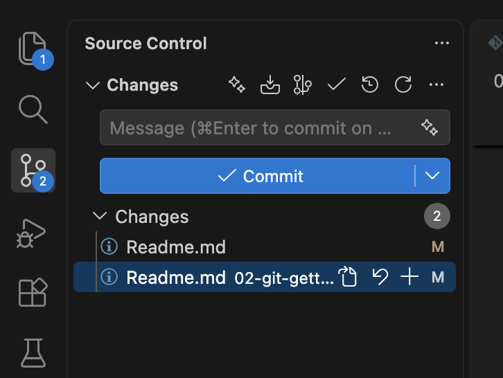

# Git:

Git ist ein verteiltes Versionskontrollsystem, mit dem man Änderungen an Dateien – vor allem Quellcode – nachverfolgen kann. Jede Änderung wird als **Commit** gespeichert, sodass man jederzeit zu früheren Ständen zurückkehren kann. Da jeder Entwickler eine vollständige Kopie des Repositorys besitzt, eignet sich Git ideal für die Zusammenarbeit im Team – z. B. über Plattformen wie GitHub oder GitLab.

## Grundbegriffe

### Was ist ein Repository?

Ein Repository (kurz: Repo) ist der Speicherort eines Projekts, in dem Git alle Dateien und deren komplette Änderungshistorie verwaltet. Es liegt als versteckter Ordner `.git` im Projektverzeichnis und kann lokal auf dem eigenen Rechner oder remote (z. B. auf GitHub) existieren.

### Was ist ein Commit?

Ein Commit ist ein gespeicherter Zwischenstand des Projekts – wie ein Schnappschuss aller Dateien zu einem bestimmten Zeitpunkt. Jeder Commit hat eine eindeutige ID und eine Nachricht, die beschreibt, was geändert wurde. So lässt sich die Historie nachvollziehen und jederzeit zu einem früheren Stand zurückkehren.

## Git installieren

Unter Ubuntu/WSL ist Git meist schon vorinstalliert. Falls nicht:

```bash
sudo apt update
sudo apt install git
```

Mit `git --version` prüfen, ob die Installation erfolgreich war.

## Getting started

1. Globale Git-Informationen hinterlegen: [Hier dokumentiert](https://git-scm.com/book/ms/v2/Getting-Started-First-Time-Git-Setup)

```bash
git config --global user.name "John Doe"
git config --global user.email johndoe@example.com
```

Das muss man nur einmalig pro Computer machen.

## Die grundlegendsten Git-Befehle

| Befehl                      | Beschreibung                                                        |
| --------------------------- | ------------------------------------------------------------------- |
| `git init`                  | Ein neues Repository im aktuellen Ordner anlegen                    |
| `git clone <url>`           | Ein bestehendes Repository (z. B. von GitHub) herunterladen         |
| `git status`                | Anzeigen, welche Dateien geändert oder neu sind                     |
| `git add <datei>`           | Änderungen für den nächsten Commit vormerken (`git add .` für alle) |
| `git commit -m "Nachricht"` | Vorgemerkte Änderungen als Commit speichern                         |
| `git log`                   | Die Commit-Historie anzeigen                                        |
| `git push`                  | Lokale Commits zum Remote-Repository hochladen                      |
| `git pull`                  | Änderungen vom Remote-Repository herunterladen                      |

Der typische Arbeitsablauf ist also: Dateien ändern → `git add` → `git commit` → `git push`.
Wir belassen es erstmal bei der VS-Code Exension und nutzen Gut darüber. Siehe Bild:



## Aufgabe: Dein erstes Repository mit VS Code

In dieser Aufgabe legst du ein Repository an und erstellst deine ersten Commits – ganz ohne Git-Befehle, nur mit der grafischen Oberfläche von VS Code (Ansicht **Quellcodeverwaltung** / **Source Control**, das Symbol mit den drei verbundenen Punkten in der linken Seitenleiste).

### Schritt 1: Projektordner anlegen und öffnen

1. Erstelle einen neuen, leeren Ordner, z. B. `mein-erstes-repo`
2. Öffne den Ordner in VS Code über **Datei → Ordner öffnen…**

### Schritt 2: Repository initialisieren (`git init`)

1. Klicke in der linken Seitenleiste auf das Symbol **Quellcodeverwaltung**
2. Klicke auf den Button **Repository initialisieren** (_Initialize Repository_)
3. VS Code legt nun im Hintergrund den versteckten `.git`-Ordner an – dein Ordner ist jetzt ein Git-Repository

### Schritt 3: Eine Datei erstellen

1. Erstelle im Explorer von VS Code eine neue Datei `notizen.md`
2. Schreibe ein paar Zeilen Text hinein und speichere die Datei
3. Wechsle zurück zur Quellcodeverwaltung: Die Datei erscheint dort unter **Änderungen** (_Changes_) mit einem grünen **U** (= _Untracked_, also neu und noch nicht von Git verfolgt)

### Schritt 4: Änderung vormerken (Staging, entspricht `git add`)

1. Fahre mit der Maus über die Datei `notizen.md` in der Liste **Änderungen**
2. Klicke auf das **+** (Änderungen stagen / _Stage Changes_)
3. Die Datei wandert in den Bereich **Zur Übernahme bereitgestellt** (_Staged Changes_) – sie ist jetzt für den nächsten Commit vorgemerkt

### Schritt 5: Commit erstellen (`git commit`)

1. Schreibe oben in das Textfeld eine kurze Commit-Nachricht, z. B. `Meine erste Notiz hinzugefügt`
2. Klicke auf den blauen Button **Commit**
3. Glückwunsch – dein erster Commit ist gespeichert! Die Liste der Änderungen ist jetzt leer

### Schritt 6: Eine Änderung committen

1. Öffne `notizen.md` erneut, ergänze eine weitere Zeile und speichere
2. In der Quellcodeverwaltung erscheint die Datei nun mit einem gelben **M** (= _Modified_, also geändert). Klicke auf die Datei: VS Code zeigt dir den Unterschied zum letzten Commit an
3. Stage die Datei wieder über das **+**, schreibe eine passende Nachricht (z. B. `Notiz erweitert`) und klicke auf **Commit**

### Kontrollfragen

- Was bedeutet das **U** bzw. das **M** neben einer Datei in der Quellcodeverwaltung?
- Warum braucht jeder Commit eine Nachricht?
- Welchen Git-Befehlen entsprechen die Buttons **Repository initialisieren**, **+** und **Commit**?
